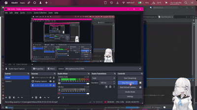

# Nova Learning Center

A simple **mini learning system** focused on quizzes and user management. This project highlights the **core functionality** of a learning platform rather than UI design.

Built mainly for **educational purposes**.

---

## 🎞️ Demo Preview

---

## ✨ Features

* 🏠 **Main System / Dashboard**
  * Acts as the main hub after login, giving access to dashboards and quizzes shows simplified data for users to view.

* 📊 **Dashboards**
  * **Student / Instructors**: Create quizzes, add questions, manage quiz dataview available quizzes, take quizzes, and submit answers
  * **Chatbot**: Can assist user by asking questions related to their problem.
  * **Profile**: Displays users details and their personal overall statistics that shows everything they have done.

* 📝 **Quiz System**

  * Create multiple-choice quizzes
  * Take quizzes interactively
  * Automatic score checking and saving

---

## 🗄️ Database

Stores:

* User accounts
* Quiz details
* Questions and answers
* Quiz results and scores

---

## 🛠️ Tech Stack

* Java
* Java Swing (GUI)
* MySQL / SQL Database

---

## ℹ️ Notes

* UI may change and improve over time
* Calendar feature was removed
* Focus is on system logic and functionality
* About the chatbot that may not work since it was integrated locally but if you wish to have one then check on my other project as to setting it up since the ai that was used for chatbot was integrated from my previous project
---

## 👤 Created By

**Franz Angelo / Pranziss**
2nd Year College Student | Developer

---

📌 *NOVA Learning Center – a simple quiz-based learning system.*
